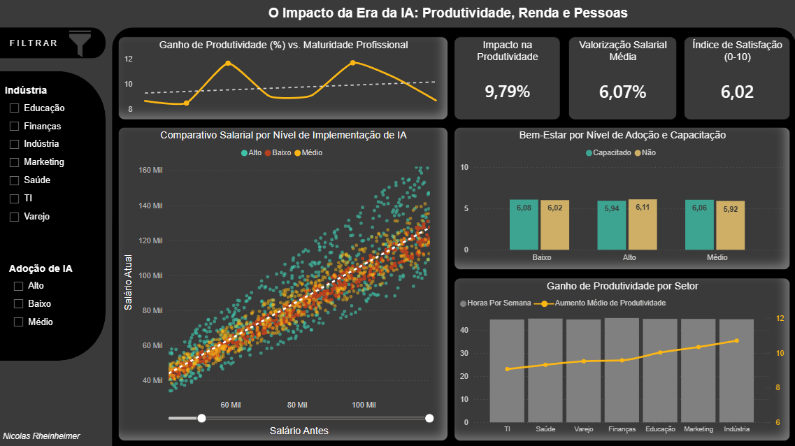
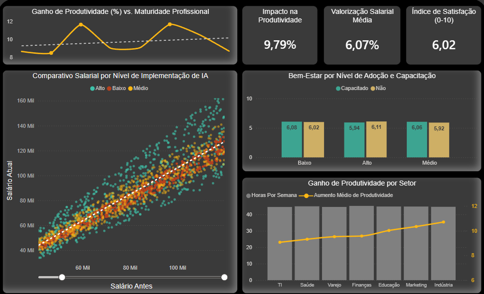

# AI Impact Analysis - Productivity, Compensation, and Employee satisfaction
> 🇧🇷 **Looking for Portuguese?** [Clique aqui para a versão em Português](./README.pt-br.md).

<br>



- The dashboard interface and metrics were localized to Portuguese to better serve the target audience and demonstrate data translation techniques using Power Query (M Language).
---
<br>


## 📌 Project Description

This project analyzes how Artificial Intelligence adoption is transforming the job market, focusing on productivity, compensation, and employee satisfaction.

The analysis uses real-world data to identify automation patterns and efficiency gains across different industries.

> **Data Note:**  
> The dataset used in this project was obtained from **Kaggle**. It is a synthetic dataset specifically developed for educational purposes, enabling the exploration of analytical scenarios and the development of Data Science and Business Intelligence projects.

---
<br>

## 🛠️ Technologies Used

- **Database:** PostgreSQL (Data cleaning, normalization, and analytical queries)
- **Power BI (Desktop & Service):** Development using `.pbip` format for version control
- **Power Query (M Language):** Data transformation (ETL), column translation, and conditional logic creation
- **DAX:** Creation of calculated measures for productivity analysis, salary averages, and dynamic KPIs
- **Documentation:** Markdown & GitHub

---
<br>

## 📂 Data Modeling and Structure

The project followed a Data Engineering workflow in which the raw dataset was imported and later normalized into logical tables.

<br>

* ### Raw Dataset (`ai_jobs_affected`)

Main table containing all imported data from the original CSV file.

| Column | Description |
| :--- | :--- |
| **employee_id** | Unique employee identifier |
| **age** | Employee age |
| **gender** | Employee gender |
| **education_level** | Education level |
| **industry** | Industry sector |
| **job_role** | Job title |
| **years_experience** | Years of professional experience |
| **ai_adoption_level** | AI integration level |
| **automation_risk** | Automation risk level |
| **upskilling_required** | Indicates need for training/upskilling |
| **salary_before_ai** | Salary before AI implementation |
| **salary_after_ai** | Salary after AI implementation |
| **job_status** | Current employment status |
| **work_hours_per_week** | Weekly workload |
| **remote_work** | Remote or on-site work status |
| **job_satisfaction** | Employee satisfaction level |
| **productivity_change_percent** | Productivity variation percentage |

---

<br>

## ✅ Normalized Tables

To optimize the database structure, the data was divided into specific entities.


* ### `employees` Table

| Column | Description |
| :--- | :--- |
| **employee_id** | Identifier (Primary Key) |
| **age** | Age |
| **gender** | Gender |
| **education_level** | Education level |

<br>

* ### `job_info` Table

| Column | Description |
| :--- | :--- |
| **employee_id** | Identifier (Foreign Key) |
| **industry** | Industry sector |
| **job_role** | Job title |
| **years_experience** | Professional experience |
| **work_hours_per_week** | Weekly working hours |
| **remote_work** | Work model |

<br>

* ### `ai_impact` Table

| Column | Description |
| :--- | :--- |
| **employee_id** | Identifier (Foreign Key) |
| **ai_adoption_level** | AI adoption level |
| **automation_risk** | Automation risk |
| **upskilling_required** | Employee training status |
| **salary_before_ai** | Pre-AI salary |
| **salary_after_ai** | Post-AI salary |
| **job_status** | Employment status |
| **job_satisfaction** | Satisfaction level |
| **productivity_change_percent** | Productivity variation |

---

<br>
<br>

# 🧠 SQL Development Process


* ### Data Structuring and Ingestion (ETL)

Creation of the main database structure and ingestion of the original dataset using `COPY` for high-performance loading.

```sql
CREATE TABLE ai_jobs_affected (
    employee_id TEXT,
    industry TEXT,
    years_experience INT,
    salary_before_ai INT,
    salary_after_ai INT,
    productivity_change_percent INT
    -- Additional columns omitted for readability
);

COPY ai_jobs_affected
FROM 'C:\DataSets\ai_job_impact.csv'
DELIMITER ','
CSV HEADER;
```

---

* ### Technical Refinement (Data Cleaning)

Data type adjustments to ensure decimal precision in analytical calculations.

```sql
ALTER TABLE ai_jobs_affected
ALTER COLUMN productivity_change_percent TYPE NUMERIC;
```

---

* ### KPI Exploration and Validation

Validation of analytical metrics using `JOIN` operations between normalized tables.

```sql
SELECT 
    j.industry,
    AVG(a.productivity_change_percent) AS produtividade
FROM job_info j
JOIN ai_impact a 
    ON j.employee_id = a.employee_id
GROUP BY j.industry
ORDER BY produtividade DESC;
```

---

* ### Career and Productivity Analysis

Analysis of the relationship between professional experience and productivity gains.

```sql
SELECT
    j.years_experience,
    AVG(a.productivity_change_percent) AS produtividade
FROM job_info j
JOIN ai_impact a 
    ON j.employee_id = a.employee_id
GROUP BY j.years_experience
ORDER BY j.years_experience;
```

---

* ### Salary Comparison Before and After AI Adoption

Salary comparison before and after Artificial Intelligence adoption.

```sql
SELECT 
    AVG(salary_before_ai) AS before_ai,
    AVG(salary_after_ai) AS after_ai
FROM ai_impact;
```

---

* ### Employee Satisfaction by Automation Risk

Analysis of employee satisfaction levels in relation to automation risk.

```sql
SELECT 
    automation_risk,
    AVG(job_satisfaction) AS satisfacao
FROM ai_impact
GROUP BY automation_risk;
```
---
<br>

## ⚡ Power Query (M Language)

I also performed several adjustments using M Language in Power Query.

- Fully translated filters and column names from English to Portuguese to ensure project consistency.
- Refactored the original “Training Required” column into a positive “Trained Employee” logic, improving executive readability within the dashboard.
- Handled case sensitivity errors that emerged after the translation process.

---

<br>

## 📊 Analytical Intelligence (DAX)

Developed measures to transform raw data into strategic indicators (KPIs).

- Calculation of percentage and absolute variation between salaries before and after AI implementation.
- Dynamic measures to calculate average productivity segmented by industry and technology adoption level.
- Metrics designed to correlate automation risk with employee satisfaction levels.

---

<br>

## 🎯 Business Problem

Artificial Intelligence is transforming industries and reshaping the way professionals work.

This project aims to answer strategic questions such as:

- Does AI adoption increase productivity?
- How does AI impact salaries?
- Which sectors benefit the most?
- Is there a relationship between automation and employee satisfaction?
- Does professional experience influence productivity gains?

---

<br>

## 📊 Dashboard Preview

The dashboard provides an executive overview of AI impact metrics.



- Productivity KPIs
- Salary evolution analysis
- Automation impact analysis
- Correlation between satisfaction and automation risk
- Interactive filters
- Industry comparisons

---

<br>

## 💡 Results and Strategic Insights

In this section, the main business questions are answered through analytical interpretation of the dashboard visualizations.

* **Does AI adoption increase employee productivity?**

Yes. We observed an average global productivity increase of **9.79%**.

Industry analysis reveals that this gain is even more significant within the **Industrial sector**, surpassing **11%**, positioning AI as a critical performance accelerator.

---

* **How does AI impact salaries?**

Technology acts as a salary appreciation catalyst, generating an average increase of **6.07%**.

Professionals working in highly AI-driven environments reached salaries above **160 thousand**, outperforming the average market trend.

---

* **Which industries benefit the most from AI?**

**Industry and Marketing** lead productivity growth rankings.

This suggests that sectors with standardized processes or strong content-generation demand absorb AI value more rapidly.

---

* **Does AI compromise employee satisfaction?**

The data indicates stable satisfaction levels.

Regardless of technological adoption levels, satisfaction remained close to **6.02**, indicating balanced organizational adaptation.

---

* **Are productivity gains consistent throughout the entire professional journey?**

No. The analysis demonstrates non-linear behavior, with productivity peaks and declines across different career stages.

This indicates the need for tailored support strategies for each experience level.

---

<br>

## 👨‍💻 Conclusion

- I noticed that employee dissatisfaction often does not directly correlate with AI adoption or automation risk. This is a strong signal for HR teams: workplace well-being is likely more connected to culture, leadership, and psychological safety than to technological tools alone.

- Although the dataset presents subtle variations, the consistency of the data reinforces that AI is not a “silver bullet” capable of transforming everything overnight, but rather a tool for incremental and continuous improvement.

- The greatest value of this project is not only measuring productivity, but understanding where human intervention (upskilling) is necessary to prevent automation from becoming a bottleneck instead of an accelerator.

---

>This project was an end-to-end exercise, from SQL structuring to storytelling in Power BI.

*Produced by Nicolas Rheinheimer - Data Analytics & Data Science Projects*
